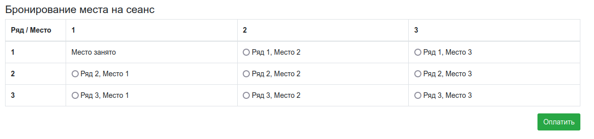
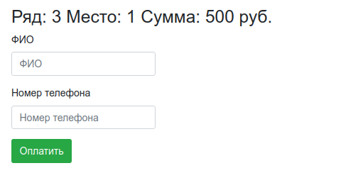
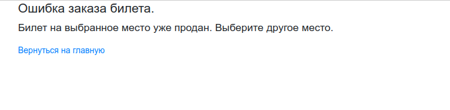

# job4j_cinema

## Проект - Cinema - Servlets
 <i><h4>Страница выбора меcта 

 <i><h4>Страница ввода данных 

 <i><h4>Страница ошибки заказа билета, который уже продан 

## Контакты для связи 
 arvikvan@gmail.com 
 @ArvikV

##Используемые технологии:
- Maven
- Java EE Servlet API
- JDBC
- PostgreSQL
- Travis CI
- Apache Tomcat
- Java Script

